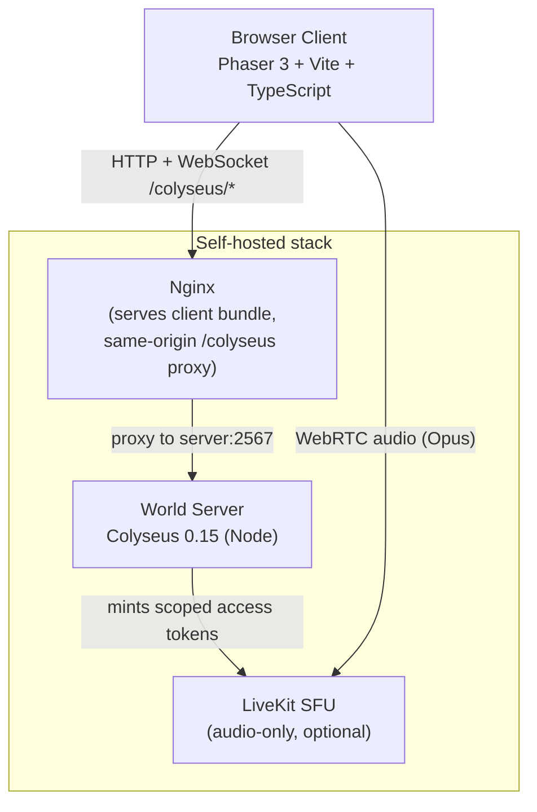
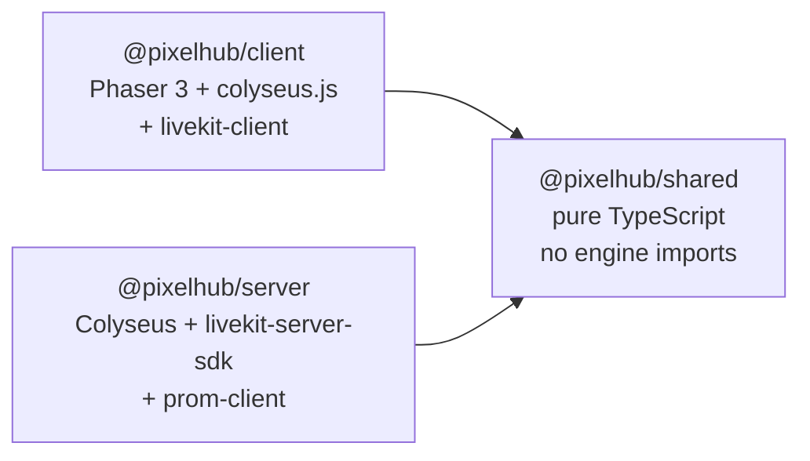

# System Overview

PixelHub is a self-hosted, Gather.town-style 2D virtual space. Players walk a pixel world with an avatar, and only the people near them can read their chat or hear their voice. Everything runs from one pair of Docker images sized for a 1 vCPU VPS.

## High-Level Architecture

The browser only ever talks to a single origin. Nginx serves the static client bundle and proxies the same-origin `/colyseus` path (HTTP matchmaking plus the WebSocket upgrade) to the world server. Voice, when configured, is a separate WebRTC connection from the browser to the LiveKit SFU using a token the server minted.

## Three Packages

PixelHub is a pnpm workspace with a strict client / server / shared split.

### `@pixelhub/shared`

The deterministic core, with no framework or engine imports. Because both sides depend on it, client prediction runs the exact same code as server authority.

| Module | Responsibility |
|--------|---------------|
| `constants.ts` | All tunables: `TILE_SIZE`, `MAP_WIDTH`/`MAP_HEIGHT` (40x30), `TICK_RATE` (20), `PROXIMITY_RADIUS` (5), `MAX_CLIENTS` (16), name/message caps, rate-limit config, colors |
| `map.ts` | Builds the fixed 40x30 tile world (border + interior obstacles), `SPAWN_POINTS`, `isWalkable` |
| `collision.ts` | `isBoxBlocked` box-vs-tile overlap test |
| `movement.ts` | `stepPlayer` integrator (per-axis, wall-sliding), `directionFor`, `sanitizeInput` |
| `proximity.ts` | `tileDistance`, `isWithinProximity`, `filterChatRecipients` |
| `proximityAudio.ts` | `audioGainForDistance` (linear falloff), `computeAudioPeers` |
| `validation.ts` | `validateDisplayName`, `validateChatMessage` |
| `rateLimit.ts` | Immutable sliding-window `checkRateLimit` |
| `types.ts` | `Position`, `MovementInput`, `ChatBroadcast`, `AudioTokenPayload`, `MessageType` |

### `@pixelhub/server`

The authoritative Colyseus world. `WorldRoom` owns state, runs the tick loop, validates all input, filters chat, and mints LiveKit tokens. `metrics.ts` exposes Prometheus counters and gauges; `app.config.ts` wires the room plus `/health` and `/metrics` HTTP endpoints; `config.ts` reads `PORT` and the optional `LIVEKIT_*` credentials from the environment.

### `@pixelhub/client`

The Phaser front end. `main.ts` wires the join flow, chat, and voice. `WorldScene` renders the map and avatars, runs local prediction and remote interpolation, and draws proximity/speech/voice indicators. `net/` wraps the Colyseus connection and typed state access. `audio/voiceManager.ts` drives the LiveKit room. `ui/` holds the join screen, chat panel, and voice controls. Every texture is generated at runtime in `game/textures.ts`.

## Component Responsibilities

### Browser client
- Renders the tile world and avatars with Phaser 3.
- Sends movement intent (not positions) and chat messages over the Colyseus room.
- Predicts the local avatar and interpolates remote ones from the 20 Hz state stream.
- When voice is configured, publishes its microphone to LiveKit and subscribes only to nearby peers, scaling each peer's volume by distance.

### Nginx (client container)
- Serves the static client bundle with SPA fallback and long-lived asset caching.
- Proxies the same-origin `/colyseus/` path to `server:2567`, including the WebSocket upgrade, with long read/send timeouts for persistent connections.

### World server
- Authoritative simulation: integrates every player each tick from server-owned positions.
- Validates and sanitizes all client input; rate-limits and proximity-filters chat.
- Mints least-privilege, audio-only LiveKit tokens per player when voice is configured.
- Exposes `/health` and Prometheus `/metrics`.

### LiveKit SFU (optional)
- Routes Opus audio tracks between participants of one shared room.
- Enforces the grants encoded in each player's token (audio publish only).

## Key Design Decisions

See the [ADRs](../adr/) for the full decision records.

| Decision | Choice | Rationale |
|----------|--------|-----------|
| Realtime multiplayer | Colyseus 0.15 authoritative rooms | Server-owned state, schema sync, fixed-rate tick out of the box ([ADR-001](../adr/001-technology-stack.md)) |
| Movement authority | Server-authoritative, client predicts | Prevents teleport/wall-hacks; identical shared integrator both sides ([ADR-002](../adr/002-server-authoritative-movement.md)) |
| Tick rate | 20 ticks/s | Responsive after interpolation, cheap for a 1 vCPU host ([ADR-002](../adr/002-server-authoritative-movement.md)) |
| Proximity | Single 5-tile radius, chat hard cutoff, voice linear falloff | One honest "conversation bubble"; chat filtered server-side ([ADR-003](../adr/003-proximity-model.md)) |
| Voice | Self-hosted LiveKit, audio-only, opt-in | Fits the host's CPU/bandwidth budget; least-privilege tokens ([ADR-004](../adr/004-audio-only-voice.md)) |
| Shared logic | Pure TypeScript workspace package | Prediction and authority run byte-identical code ([ADR-001](../adr/001-technology-stack.md)) |
| Rendering | Phaser 3, programmatic textures | Mature 2D engine, no art assets to license ([ADR-001](../adr/001-technology-stack.md)) |

For sequence diagrams, the tick loop, state sync internals, the proximity pipeline, and the LiveKit token flow, see [System Design](./system-design.md).
