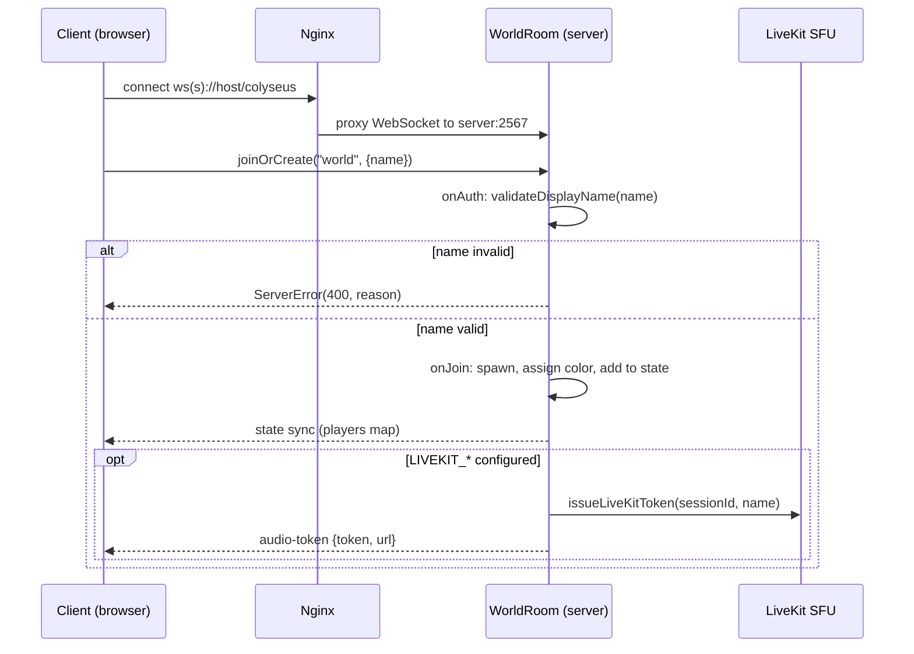
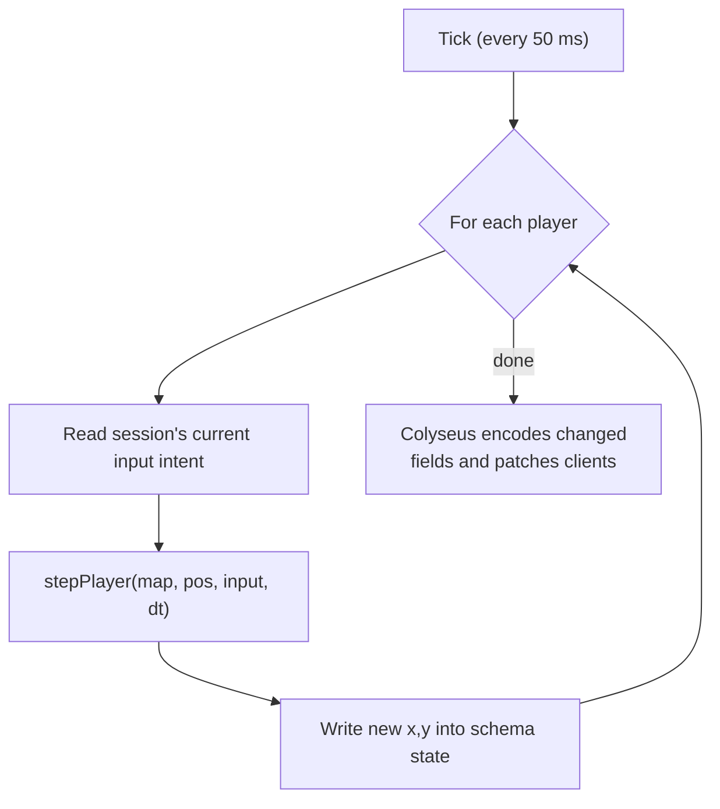
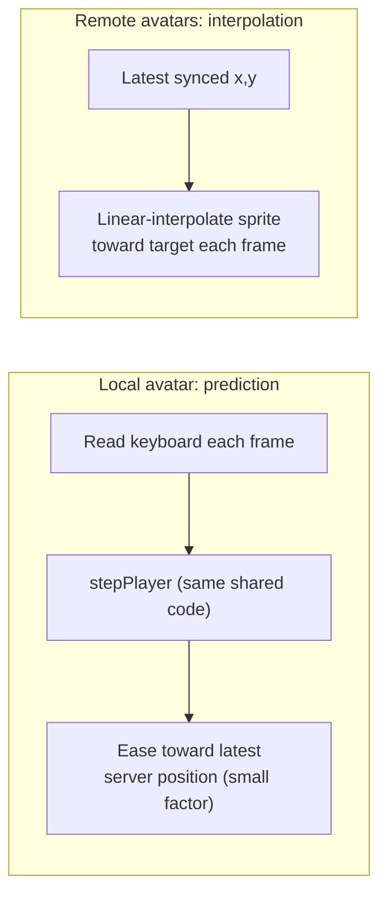
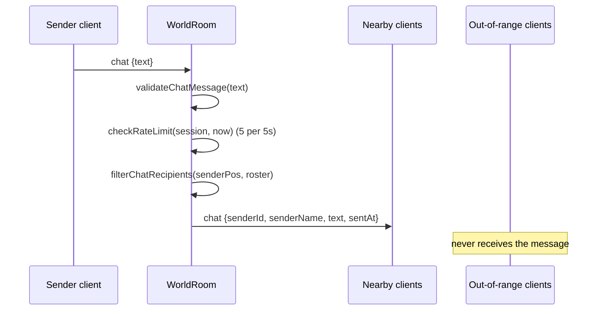
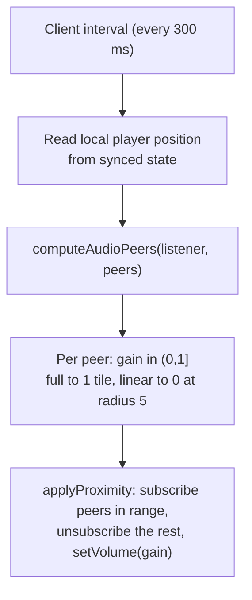
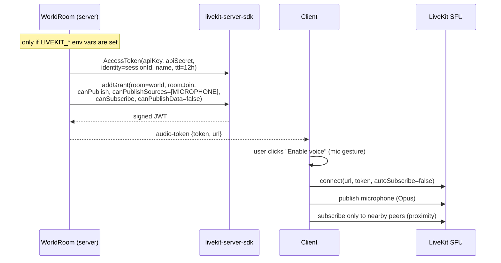
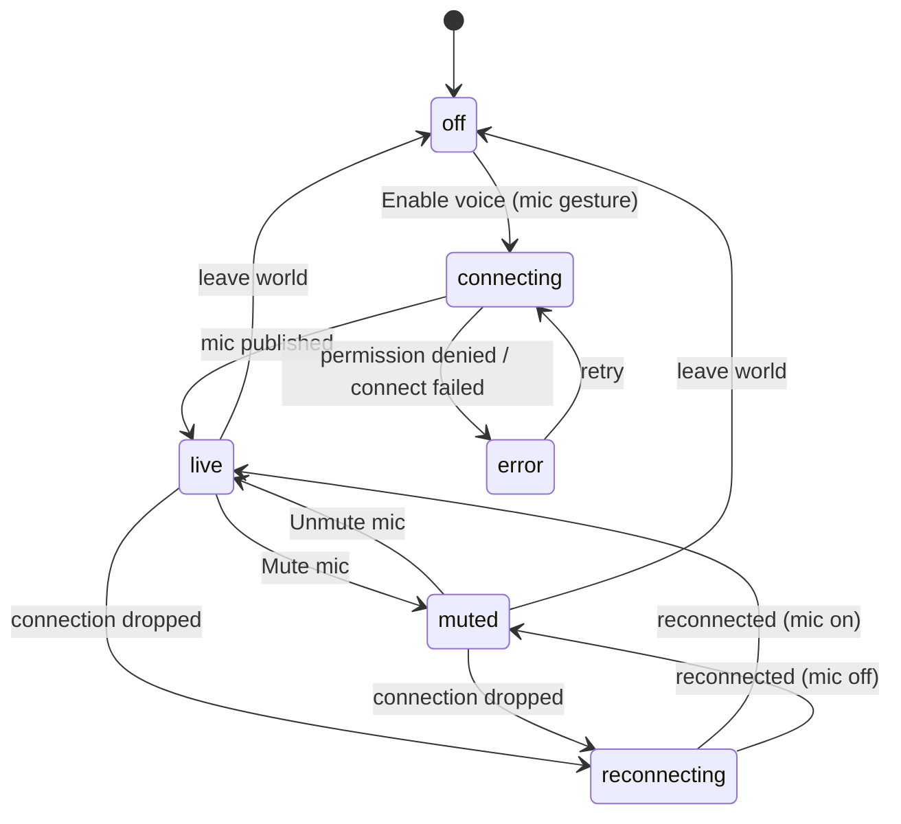

# System Design

This document covers the runtime internals: how a client joins, the server tick loop, how Colyseus keeps clients in sync, how the client hides latency, the proximity pipeline for chat and voice, and the LiveKit token flow. For the static component map see [System Overview](./overview.md); for the reasoning behind each choice see the [ADRs](../adr/).

## Join and Session Lifecycle

`onAuth` runs before the player enters the world, so an invalid name is rejected with a `400` and never occupies a slot. On `onJoin` the server picks a guaranteed-walkable spawn tile round-robin from `SPAWN_POINTS`, assigns an avatar color round-robin from `PLAYER_COLORS`, adds a `Player` to the synced state, and records per-session bookkeeping (current input intent, chat rate-limit state) that is never synced to clients. If voice is configured, the token is minted and sent fire-and-forget: a token failure disables voice for that one client but never fails the join.

## The Tick Loop

The room installs a fixed-rate simulation via `setSimulationInterval(update, 1000 / TICK_RATE)`, so `update(dt)` runs 20 times per second.

Clients never send positions. Between ticks, a client's inbound `input` message updates only that session's stored intent (`handleInput` replaces the session's `input` immutably). The tick reads that intent and integrates it with the shared `stepPlayer`, which normalizes direction, clamps to bounds, and resolves each axis independently against the collision map so avatars slide along walls. See [ADR-002](../adr/002-server-authoritative-movement.md).

## State Sync, Prediction, and Interpolation

### Server to client: schema sync

World state is a `WorldState` schema holding a `MapSchema<Player>` keyed by sessionId. Each `Player` carries `name`, `color`, `x`, `y`. Colyseus binary-encodes only the fields that changed each patch and reflects them into `room.state` on every client. The client wraps this with a typed accessor (`playersOf`) and subscribes to structural changes (`onAdd`, `onRemove`) and per-field updates (`player.listen('x', ...)`).

### Client-side latency hiding

A raw 20 Hz feed would look choppy and lag the local player behind their own keys. `WorldScene` hides this without ever becoming authoritative:

- **Local player.** The client runs the same `stepPlayer` each rendered frame so movement is instant, then eases the prediction toward the latest server position with a small correction factor. Because both sides run identical code, corrections are tiny and there is no rubber-banding.
- **Remote players.** Each remote sprite is linearly interpolated toward its last synced position every frame, turning 20 discrete updates per second into fluid motion. A walk animation plays whenever the sprite is still moving toward its target.

The camera follows the local avatar. Input is suppressed while a text field is focused, and the client only sends an `input` message when the intent actually changes.

## Proximity Pipeline

One radius, `PROXIMITY_RADIUS = 5` tiles, governs both channels, but they consume it differently. See [ADR-003](../adr/003-proximity-model.md).

### Chat: server-side hard cutoff

The server validates the message, enforces the rate limit, then computes the recipient set with `filterChatRecipients` over the current authoritative positions and sends the broadcast only to session ids in range. Out-of-range clients receive nothing, so the cutoff is a real privacy boundary, not a display filter. A rejected message (invalid, empty, too long, or rate-limited) returns a `chat-error` only to the sender.

### Voice: client-side graded subscription

Every player is in one shared LiveKit room. The client recomputes the audible set every 300 ms from server-authoritative positions using `computeAudioPeers`, then subscribes to in-range peers, unsubscribes the rest, and sets each participant's volume to its distance gain. The same interval drives on-screen indicators (nearby names, speaking rings).

## LiveKit Token Flow

The token is least-privilege: it can join exactly one room, publish audio from the microphone source only, and subscribe to others. It cannot publish a camera or data. Identity is the Colyseus sessionId, so LiveKit participants map 1:1 to world avatars and proximity can address them directly. The client connects with `autoSubscribe: false` and opts in per peer, so it only ever pulls audio it actually wants. Voice choice (`live` / `muted`) is persisted in `localStorage`, so after a refresh the client reconnects to voice by itself; the browser only re-asks for the microphone if permission was granted one time only. See [ADR-004](../adr/004-audio-only-voice.md).

## Voice State Machine (Client)

The voice toggle drives one state machine in `VoiceManager`:

`muted` keeps the LiveKit connection open listen-only, so the player still hears nearby peers without an open microphone. On a permission denial the client stays connected listen-only rather than tearing voice down.

## Observability

The server exposes a deliberately tiny Prometheus surface (no default process metrics, to keep the scrape cost negligible on a shared host):

| Metric | Type | Meaning |
|--------|------|---------|
| `pixelhub_players_connected` | Gauge | Players currently in the world |
| `pixelhub_players_joined_total` | Counter | Total joins since start |
| `pixelhub_chat_messages_total` | Counter | Proximity chat messages delivered |
| `pixelhub_voice_tokens_issued_total` | Counter | LiveKit tokens issued |

Served at `GET /metrics`; `GET /health` returns `{"status":"ok"}`.

## Capacity

`MAX_CLIENTS = 16` caps a room, and the realistic target on the shared 1 vCPU / 4 GB host is roughly 10 to 15 concurrent users. All proximity work is O(n) per event over that small n, the tick is a fixed 20 Hz, and voice is audio-only, so the whole system stays inside the host's budget. Scaling past one node (multiple rooms, multiple hosts) is out of scope for v1.
