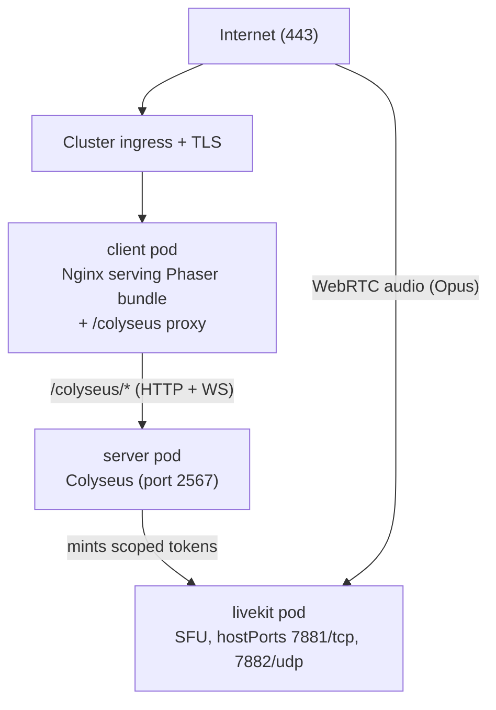
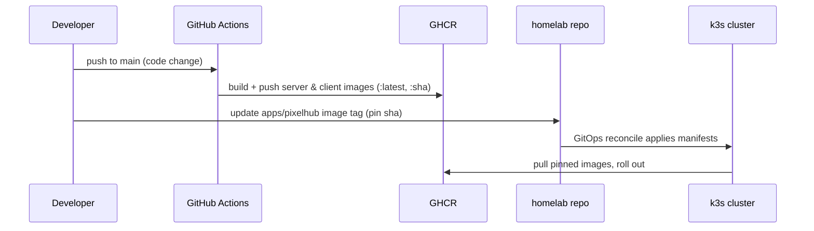

# Deployment Guide

PixelHub deploys through the [homelab](https://github.com/mateuseap/homelab) GitOps cluster: a k3s single node on a 1 vCPU / 4 GB VPS. This repository builds and publishes two container images to GHCR; the homelab repository holds the Kubernetes manifests that run them. For local development see the [Development Setup](../development/setup.md).

## Architecture



The browser reaches PixelHub through the cluster ingress at a single origin. Nginx in the client pod serves the static bundle and proxies the same-origin `/colyseus` path to the `server` Service on port `2567`. Voice media flows directly between the browser and the LiveKit pod over WebRTC.

## Images

GitHub Actions builds both images on every push to `main` that touches code (docs-only and Markdown changes are skipped) and publishes them to GHCR:

| Image | Built from | Contents |
|-------|-----------|----------|
| `ghcr.io/mateuseap/pixelhub-server` | `docker/Dockerfile.server` | Multi-stage Node 20 Alpine build; runs `node dist/index.js`, exposes `2567` |
| `ghcr.io/mateuseap/pixelhub-client` | `docker/Dockerfile.client` | Multi-stage build; Nginx Alpine serving the client bundle with the bundled `nginx.client.conf`, exposes `80` |

Each image is tagged both `:latest` and `:<git-sha>` (`.github/workflows/publish-images.yml`), so the cluster can pin an immutable SHA.

## The `apps/pixelhub` Manifests (homelab)

PixelHub lives as `apps/pixelhub/` in the homelab repository, following the same GitOps pattern as the other apps in that cluster. At a high level the manifests declare:

- A **`server` Deployment + Service** running the server image, listening on `2567`. The Service is named `server` so the client Nginx `upstream colyseus { server server:2567; }` resolves it by DNS inside the cluster (the same name works in Docker Compose and in Kubernetes).
- A **`client` Deployment + Service** running the Nginx client image on `80`.
- An **ingress route** with TLS that sends public traffic to the client Service.
- A **LiveKit Deployment + Service** for the SFU (see below), present only when voice is enabled.
- **Sealed secrets** holding the LiveKit credentials, so nothing sensitive is ever committed in plaintext.

The exact resource files are maintained in the homelab repository; this guide documents the contract PixelHub expects from them.

## LiveKit (Voice)

Voice is optional. When enabled, LiveKit runs as its own pod in the cluster. Because WebRTC needs direct reachability, the SFU is exposed on host ports rather than only cluster-internal ones:

| Port | Protocol | Purpose |
|------|----------|---------|
| `7881` | TCP | ICE/TCP fallback for clients that cannot use UDP |
| `7882` | UDP | Primary RTC media transport (Opus audio) |

The LiveKit signaling URL is fronted with TLS and handed to the server as `LIVEKIT_URL` (a `wss://` URL). The version deployed in the cluster is **LiveKit v1.13.4**.

## Environment Variables

The **server** pod reads its configuration from the environment (`server/src/config.ts`). Secrets come from sealed secrets, never from the image or the manifests in plaintext.

| Variable | Required | Default | Description |
|----------|----------|---------|-------------|
| `PORT` | No | `2567` | Colyseus listen port. Validated at startup; an invalid value refuses to boot. |
| `LIVEKIT_URL` | For voice | none | Public `wss://` URL of the LiveKit SFU. |
| `LIVEKIT_API_KEY` | For voice | none | API key id used to sign access tokens. |
| `LIVEKIT_API_SECRET` | For voice | none | API secret used to sign access tokens. |

Voice is enabled only when all three `LIVEKIT_*` variables are present. If any is missing, the server issues no tokens and the client shows no voice UI, with zero other behavior change. The client needs no build-time configuration: it always talks to the same-origin `/colyseus` path and receives the LiveKit URL at runtime inside the audio token.

## Deploy Flow (GitOps)



1. Merging to `main` builds and publishes both images to GHCR.
2. The homelab manifests reference the image (pinning a SHA is preferred over `:latest` for reproducibility).
3. The cluster's GitOps reconciler applies the manifests and rolls out the new pods.

## Verifying a Deploy

```bash
# server liveness (inside the cluster or via a port-forward)
curl http://<server>/health
# → {"status":"ok"}

# Prometheus metrics
curl http://<server>/metrics
# → pixelhub_players_connected, pixelhub_players_joined_total,
#   pixelhub_chat_messages_total, pixelhub_voice_tokens_issued_total
```

From a browser, load the public URL, join with a name, and confirm movement syncs across two tabs. If voice is enabled, the "Enable voice" button appears after join; enabling it should request the microphone once and let two nearby avatars hear each other.

## Nginx (Client Pod)

`docker/nginx/nginx.client.conf` is baked into the client image. It:

- Serves the Phaser SPA with fallback (`try_files $uri $uri/ /index.html`).
- Proxies `location /colyseus/` to `http://colyseus/` (the `server:2567` upstream), forwarding the WebSocket upgrade headers and using long read/send timeouts (`3600s`) so persistent room connections are not cut.
- Gzip-compresses JS/CSS/JSON/SVG (the Phaser chunk is ~1 MB uncompressed).
- Sets 1-year immutable cache headers on hashed static assets.

TLS is terminated at the cluster ingress; the client Nginx speaks plain HTTP on the internal network.

## Capacity

The target host is a shared 1 vCPU / 4 GB node. A room is capped at `MAX_CLIENTS = 16`, with a realistic target of roughly 10 to 15 concurrent users for v1. The 20 Hz tick, O(n) proximity work, and audio-only voice are all sized to fit that budget. See [ADR-004](../adr/004-audio-only-voice.md) for why voice is audio-only.
